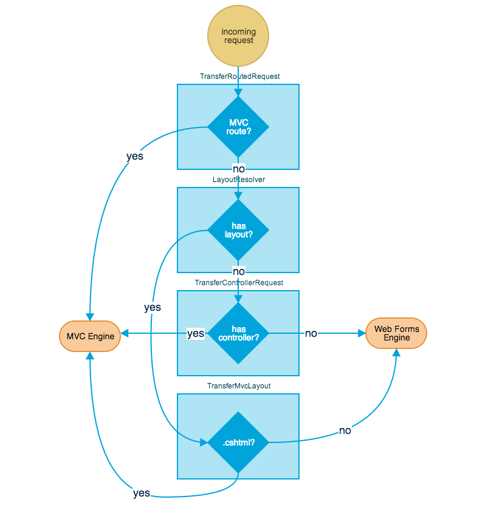

# Sitecore MVC

Sitecore's architecture is made modular and easily extensible through the use of many pipelines. The `web.config` defines which pipelines are used for which operation, and Sitecore transfers execution of an operation to the correspondent pipeline. Each pipeline, as the name suggests, contains a set of processors which are executed in sequence. Each processor contains a `Process()` method that accepts a single argument and returns nothing. A processor has the ability of aborting the pipeline, using the `AbortPipeline()` method, which makes sure that all the processors that follows the current one in that specific pipeline do not get called.

To use John West's words:

> Pipelines assist with **encapsulation**, **flexible configuration**, **separation of concerns**, **testability** and other objectives. Once you start implementing features with pipelines, you wonder how you ever configured enterprise systems without them.

*(to dig deeper and learn how to create and run your own custom pipelines in Sitecore, check out [this article](http://adeneys.wordpress.com/2008/08/27/creating-and-running-custom-pipelines-in-sitecore/) by Alistair Deneys)*

### The HttpRequestBegin Pipeline
*(for more details, read the in-depth article on the httpRequestBegin pipeline on [InSitecore](http://insitecore.tumblr.com/post/37734162227/sitecore-httprequestbegin-pipeline-in-detail))*

This is the longest Sitecore pipeline, with over 20 processors being executed. It takes the incoming *http request* and determines how the request should be handled. 

After a few diagnostic related processors, the pipeline fires up the `Site Resolver` processor, in charge of determining which *Sitecore site* (as per the site definitions inside the `configuration/sitecore/site` section of the `web.config`) should handle the incoming request and updated the `Sitecore.Context.Site` with this piece of information.

Next, the `UserResolver` processor is in charge of determining which Sitecore user sent the request. This processor will fill `Sitecore.Context.User` with the correct value (which can be *Anonymous*).

Next, the `DatabaseResolve` processor determines which database should be used by Sitecore to retrieve the items necessary to fulfill the incoming request. Then the `DeviceResolver` processor finds which Sitecore device should be used to handle the request.

After those processors are done, the `LanguageResolver` takes care of determining which language should be used to handle the request and saves the correct value in `Sitecore.Context.Language`.

Then a few processors take care of very specific type of requests, such as incoming requests for Sitecore media item, requests for specific Sitecore items (by using the `sc_itemid` query string parameter), Sitecore aliases and requests for physical files.

Next, the `ItemResolver` needs to determine which Sitecore item should be used to fulfill the request and saves its value in `Sitecore.Context.Item`.

Once the item has been determined, the `LayoutResolver` processor is in charge of determining which *Sitecore Layout* needs to be used to generate the response to be sent back. 

Finally, the last processor, called `ExecuteRequest`, does some last minute checks to make sure that the previous processors were able to resolve a *Sitecore site*, a *Sitecore item* and a valid *Sitecore layout* and, if all looks good, Sitecore updates the `HttpContext`'s path to point to the location of the physical file to execute.

### Sitecore MVC and the HttpBeginRequest Pipeline

If you followed up to this point, you might be wondering why are we diving so deep into the `HttpBeginRequest` pipeline. After all, most Sitecore developers probably never even need to open the hood of this pipeline during their daily development work. What is interesting for us, though, from a Sitecore MVC perspective, is the fact that Sitecore MVC added some important hooks in this pipeline.

First, right after the `ItemResolver`, Sitecore MVC inserts a new processor, the `TransferRoutedRequest`:

    <processor type="Sitecore.Mvc.Pipelines.HttpRequest.TransferRoutedRequest, Sitecore.Mvc" patch:after="processor[@type='Sitecore.Pipelines.HttpRequest.ItemResolver, Sitecore.Kernel']" />
    
This processor is in charge of redirecting to the Sitecore MVC rendering engine when an MVC route is matched (and aborting the pipeline).

Next, right after the `LayoutResolver`, Sitecore MVC hooks the new `TransferControllerRequest`:

    <processor type="Sitecore.Mvc.Pipelines.HttpRequest.TransferControllerRequest, Sitecore.Mvc" patch:after="processor[@type='Sitecore.Pipelines.HttpRequest.LayoutResolver, Sitecore.Kernel']" />
    
Every Sitecore item, since version 6.6, has two new fields, `Controller` and `Controller Action`, which can be utilized to tell Sitecore that, for a specific item, we want a custom MVC controller to be executed. The `TransferControllerRequest`, therefore, simply checks the content of the `Controller` field and, if it's not empty, it transfers control to it, aborting the pipeline.

Furthermore, right after the `LayoutResolver`, Sitecore MVC hooks a new processor, the `TransferMvcLayout` processor:

    <processor type="Sitecore.Mvc.Pipelines.HttpRequest.TransferMvcLayout, Sitecore.Mvc" patch:after="processor[@type='Sitecore.Pipelines.HttpRequest.LayoutResolver, Sitecore.Kernel']" />

This processor redirects to the Sitecore MVC rendering engine (aborting the pipeline) when the layout file is an MVC view (i.e. when the layout file has the `.cshtml` extension).

The following diagram summarizes the process followed by Sitecore in the `HttpBeginRequest` pipeline to determine which rendering engine needs to be used for the current incoming request.

*(To dig deeper, read the [MVC-related pipelines](mvc_with_sitecore/mvc_related_pipelines.md) chapter)*

### notes

"initialize" pipeline
runs the InitializeRoutes processor...
Sitecore.Mvc.Pipelines.Loader.InitializeRoutes.Process(PipelineArgs args)
calls...	
Sitecore.Mvc.Pipelines.Loader.InitializeRoutes.RegisterRoutes(RouteCollection routes, PipelineArgs args)
calls...
Sitecore.Mvc.Pipelines.Loader.InitializeRoutes.SetRouteHandlers(RouteCollection routes, PipelineArgs args)
creates new RouteHandlerWrapper 

Sitecore.Mvc.Routing.RouteHandlerWrapper.GetHttpHandler(RequestContext requestContext)
returns (IHttpHandler) new RouteHttpHandler

Sitecore.Mvc.Routing.RouteHttpHandler.ProcessRequest(HttpContext context)
calls
Sitecore.Mvc.Routing.RouteHttpHandler.BeginRequest()
runs 
"mvc.requestBegin" pipeline

An incoming request is handled by Sitecore MVC in the following manner: 

- Create a PageContext. 
 - mvc.requestBegin pipeline (see above how it's being called)

- Determine the requested item. 
 - the `PageContext` class contains a `GetItem()` method which runs the `mvc.getPageItem` pipeline
 

- Determine the relevant controller to invoke
 - Using the `SitecoreControllerFactory`, initialized during the `Initialize` pipeline
 - The `SitecoreControllerFactory` contains a method (`CreateSitecoreController`) which runs the `mvc.createController` pipeline
 - The `mvc.createController` pipeline checks if the item has a *custom controller* set in the `controller`/`controller action` fields. If not, it creates an instance of the `SitecoreController` class

- Build the PageDefinition and assign it to the PageContext. 

- Select the root rendering to use for generating the response (typically the layout assigned to 
the requested item). 

- Wrap an IView around the root rendering and store it in PageContext.PageView. 

- Pass the PageView to the ASP.NET MVC runtime for rendering the response to the client

        

